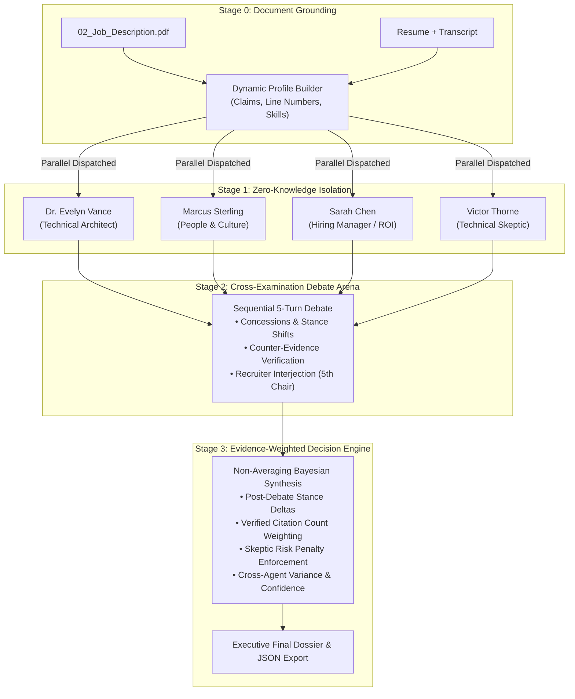

# 🏛️ Quorum — Autonomous Multi-Agent AI Interview Panel Simulator

[](https://react.dev/)
[](https://www.typescriptlang.org/)
[](https://vitejs.dev/)
[](https://expressjs.com/)
[](https://ai.google.dev/)
[](LICENSE)

**Quorum** is a production-grade Autonomous Multi-Agent AI Interview Panel Simulator designed to eliminate single-prompt bias, resume inflation, and shallow hiring evaluations. 

By modeling a real cross-functional interview committee—comprising **4 isolated AI agent personas**, an **interactive multi-turn debate arena**, a **code-enforced evidence validation engine**, and a **non-averaging Bayesian decision synthesizer**—Quorum delivers rigorous, auditable, and nuanced hiring intelligence.

---

## 🌟 Key Architectural Pillars



---

## 🧠 The 4 Agent Personas

Each agent evaluates candidates in **complete zero-knowledge isolation** during Stage 1 before entering the Stage 2 cross-examination arena:

| Agent Persona | Role Mandate | Primary Evaluation Lens |
| :--- | :--- | :--- |
| **Dr. Evelyn Vance** | Principal AI Systems Architect | Architectural depth, multi-agent state machines, retry/escalation loops, model routing, Python/FastAPI microservices. |
| **Marcus Sterling** | VP of People & Culture | Intellectual honesty, psychological safety, collaboration under technical disagreements, retention flight risk. |
| **Sarah Chen** | Director of Engineering & ROI | Long-term production ownership, operational reliability, ramp-up velocity, and business trade-offs. |
| **Victor Thorne** | Lead Technical Auditor & Skeptic | The "BS detector" — cross-examining resume claims against interview admissions, unverified metrics, and credit inflation. |

---

## 🚀 Core Features

### 1. Zero-Knowledge Parallel Isolation (Stage 1)
- 4 independent, concurrent LLM evaluations (`Promise.all`) dispatched with zero cross-agent context contamination.
- Cryptographic isolation telemetry tracking duration, token counts, and completion timestamps.

### 2. Multi-Agent Cross-Examination Arena (Stage 2)
- Genuine sequential agent-to-agent debate turns (not simulated in a single monolithic prompt).
- Real-time **stance shifts** and score revisions recorded with traceable justification (`CONCEDE`, `DEFEND`, `CHALLENGE`, `COUNTER_EVIDENCE`).
- **Recruiter Interjection (5th Chair)**: Inject custom recruiter questions or policy guidelines directly into the live debate.

### 3. Non-Averaging Bayesian Decision Engine (Stage 3)
- **Eliminates Naive Averaging**: A fatal cultural red flag or unverified credential cannot be averaged away by high technical marks.
- **Evidence Weighting**: Weights are calculated based on code-verified citation counts, debate challenge survival ($0.85\times$ concession discount vs $1.25\times$ defense multiplier), and evidence sufficiency.
- **Skeptic Risk Penalty**: Unresolved Skeptic audit concerns apply an active risk penalty ($0.82\times$) suppressing final recommendation tiers.
- **Traceable Scoring Matrix**: Every number is mapped to an agent-by-agent justification and initial-to-final stance delta.
- **Explicit Unresolved Tensions**: Multi-agent disagreements are surfaced directly rather than blended away.

### 4. Code-Enforced Evidence Traceability
- Quotes cited by LLMs undergo automated substring and token-overlap fuzzy validation against actual source texts.
- Hallucinated or inaccurate citations are flagged (`citationValid: false`, `evidenceStatus: 'unverified'`).
- Explicit handling of unclear or missing information (`evidenceStatus: "sufficient" | "insufficient" | "unverified"`).

### 5. War-Room Voice Studio
- Built-in Web Speech API audio synthesis enabling playback of multi-agent debate deliberations with persona-specific voice pitches and rates.

---

## 🔒 Security Architecture

- **Zero Client-Side Secrets**: No API keys are ever stored, exposed, or loaded in the React frontend bundle.
- **Secure Server-Side Proxy**: Express backend (`server/index.js` on port 3001) holds `GEMINI_API_KEY` from `.env` and proxies structured LLM requests.
- **Masked Logging**: Server logs display only masked key prefixes (`AQ.Ab8RN...`) and never log full secrets.
- **Offline Demo Parity**: If no API key is present, Quorum seamlessly falls back to a deterministic offline demo mode that adheres strictly to the same schema and non-averaging logic.
- **Git Safeguards**: Pre-configured `.gitignore` and secret scanning hooks prevent accidental secret commits.

---

## 🛠️ Tech Stack

- **Frontend**: React 19, TypeScript (Strict Mode), Vite 8.2, Tailwind CSS v4, Lucide Icons, Canvas Confetti.
- **Backend**: Node.js (ES Modules), Express 4.21, CORS, Dotenv.
- **LLM Engine**: Google Gemini REST API (`gemini-1.5-flash` / configurable via `GEMINI_MODEL`).
- **Persistence**: In-memory state with JSON Dossier export.

---

## ⚡ Quickstart & Local Setup

### 1. Clone the Repository
```bash
git clone https://github.com/anuj-71/Quorum.git
cd Quorum
```

### 2. Install Dependencies
```bash
npm install
```

### 3. Configure Environment (Optional for Live Gemini API)
Copy the template configuration:
```bash
cp .env.example .env
```
Edit `.env` to add your Gemini API key:
```env
GEMINI_API_KEY=your_actual_gemini_api_key
GEMINI_MODEL=gemini-1.5-flash
PORT=3001
```
*(Note: If no key is set, Quorum will automatically operate in high-fidelity `OFFLINE_DEMO` mode).*

### 4. Run the Application
To run both the Express backend and the Vite frontend concurrently:
```bash
npm run dev:full
```

Or run them individually:
```bash
# Terminal 1: Backend API Proxy
npm run server

# Terminal 2: Frontend UI
npm run dev
```

Open your browser at **[http://localhost:5173](http://localhost:5173)**.

---

## 📁 Repository Structure

```
Quorum/
├── .env.example             # Safe template for environment variables
├── .gitignore               # Strict exclusion of .env, logs, and artifacts
├── package.json             # Scripts (dev, server, dev:full, build)
├── vite.config.ts           # Vite config with backend /api proxy
├── server/
│   └── index.js             # Secure Express proxy for Gemini API calls
├── src/
│   ├── App.tsx              # Root shell orchestrator
│   ├── types/
│   │   └── index.ts         # Full TypeScript domain model & schemas
│   ├── data/
│   │   ├── defaultPrompts.ts      # Agent persona system prompts
│   │   └── preloadedCandidates.ts # Official PDF scenario dataset (Rohan & Ananya)
│   ├── engine/
│   │   ├── llmClient.ts           # Frontend HTTP client calling /api/llm
│   │   ├── agentRunner.ts         # Stage 1: 4 parallel isolated evaluations
│   │   ├── debateEngine.ts        # Stage 2: 5 sequential debate turns & interjection
│   │   ├── decisionEngine.ts      # Stage 3: Non-averaging Bayesian synthesis
│   │   ├── citationValidator.ts   # Code-enforced evidence substring matcher
│   │   └── profileBuilder.ts      # Dynamic raw document profile parser
│   └── components/
│       ├── Sidebar.tsx            # Left navigation with Live/Offline status pill
│       ├── TopHeader.tsx          # Stage breadcrumbs and controls
│       ├── DashboardView.tsx      # Overview metrics & quick switcher
│       ├── CandidatesView.tsx     # Candidate directory & profile inspection
│       ├── AgentCards.tsx         # Stage 1 isolated opinions & evidence quotes
│       ├── DebateArena.tsx        # Stage 2 interactive chat arena & stance shifts
│       ├── VoiceStudio.tsx        # Web Speech API audio debate studio
│       ├── FinalDossier.tsx       # Stage 3 executive report, matrix & breakdown
│       └── ...                    # Modals for upload, audit logs, comparison & JD
└── scripts/
    └── check-secrets.js     # Pre-commit secret scanning verification
```

---

## 📜 License

MIT License. Designed and engineered for the AI Interview Simulator specification.
