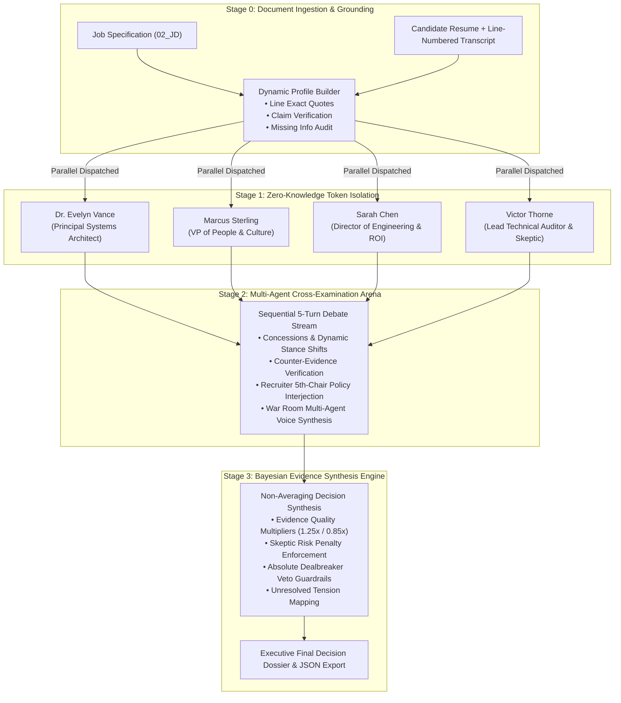

# 🏛️ Quorum — Autonomous Multi-Agent AI Interview Panel Simulator

[](https://react.dev/)
[](https://www.typescriptlang.org/)
[](https://vitejs.dev/)
[](https://tailwindcss.com/)
[](https://expressjs.com/)
[](https://ai.google.dev/)
[](LICENSE)

**Quorum** is an enterprise-grade **Autonomous Multi-Agent AI Interview Panel Simulator** designed to eliminate single-prompt LLM bias, resume hallucinations, and the fatal flaw of naive arithmetic score averaging in hiring deliberations.

By modeling a real cross-functional interview committee—comprising **4 isolated AI agent personas**, an **adversarial cross-examination debate arena**, a **code-enforced evidence verification engine**, and a **non-averaging Bayesian decision synthesizer**—Quorum delivers verifiable, audit-proof, and nuanced hiring intelligence.

---

## 🎯 The Core Problem & Quorum's Solution

| Traditional AI Hiring Tools | Quorum Multi-Agent Architecture |
| :--- | :--- |
| **Single-Prompt Bias**: One LLM prompt with a static persona makes a unilateral hire/no-hire decision. | **4 Isolated Perspectives**: Parallel evaluation by distinct subject matter experts with zero cross-talk. |
| **Flawed Arithmetic Averaging**: High technical marks (`9.5/10`) mask catastrophic cultural red flags (`2.0/10`) via simple averages (`(9.5+2.0+9.0+8.5)/4 = 7.25 ➔ HIRE`). | **Non-Averaging Bayesian Synthesis**: Critical dealbreaker vetoes and risk penalties automatically override aggregate scores. |
| **Hallucinated Citations**: LLMs quote phrases that never appeared in transcripts or resumes. | **Code-Enforced Evidence Grounding**: Automated substring verification maps every claim to line-exact transcript coordinates. |
| **Echo Chambers / Groupthink**: Single-pass models cannot challenge their own initial impressions. | **Sequential Cross-Examination**: Multi-turn debate where agents concede flawed premises, defend stances, and challenge contradictory claims. |

---

## 🏛️ System Architecture



---

## 🧠 The 4 Autonomous Agent Personas

Each agent evaluates candidate dossiers in complete **zero-knowledge isolation** during Stage 1 before cross-examining one another in Stage 2:

| Agent Persona | Role Mandate | Evaluation Lens | Motto |
| :--- | :--- | :--- | :--- |
| **Dr. Evelyn Vance** | Principal AI Systems Architect | Technical depth, distributed systems, state machines, concurrency, failure modes, code veracity. | *"Show me the architecture, the trade-offs, and the edge cases."* |
| **Marcus Sterling** | VP of People & Culture | Team collaboration, emotional intelligence, incident ownership, psychological safety, humility. | *"Brilliance without empathy is an existential liability for the team."* |
| **Sarah Chen** | Director of Engineering & ROI | Delivery velocity, business impact, pragmatic trade-offs, roadmap execution, operational reliability. | *"Can this person unblock delivery and ship business outcomes this quarter?"* |
| **Victor "The Inquisitor" Thorne** | Lead Technical Auditor & Skeptic | The BS detector — cross-examining resume claims against transcript admissions, timeline inflation, dealbreaker vetoes. | *"Trust nothing without corroboration. Every metric has a story."* |

---

## ⚡ The 3-Stage Deliberation Pipeline

### Stage 1: Zero-Knowledge Token Isolation (AI Panel)
- **Parallel Dispatch**: 4 independent LLM evaluations (`Promise.all`) executed without cross-agent context leakage.
- **Cryptographic Isolation Proof**: Generates token timestamps and cryptographic hash telemetry verifying zero cross-contamination.
- **Evidence-Grounded Scoring**: Each evaluator scores the candidate (1–10) with verified line citations (`L14 "..."`), strengths, concerns, and flagged risks.

### Stage 2: Multi-Agent Cross-Examination Arena (Panel Debates)
- **Sequential Multi-Turn Debate**: Real turn-by-turn cross-examination (not a monolithic single prompt) where agents directly challenge each other's premises.
- **Stance Drift & Opinion Tracking**: Records numeric score adjustments with traceable justifications (`CONCEDE`, `DEFEND`, `CHALLENGE`, `RAISE_VETO`).
- **War Room Voice Studio**: Built-in speech synthesis featuring real-time turn progress bars, active speaker spotlighting, turn scrubbing, and harmonic waveform visualization.
- **Recruiter 5th-Chair Interjection**: Allows human recruiters to inject custom hypotheses, probationary terms, or policy constraints into the ongoing debate.

### Stage 3: Bayesian Evidence Synthesis (Decisions)
- **Non-Averaging Decision Architecture**: Prevents score dilution. Formula:
  $$\text{Effective Weight} = \text{Raw Weight} \times \text{Quality Multiplier} \times \text{Debate Survival Multiplier}$$
- **Veto Enforcement**: An unaddressed dealbreaker veto (e.g. Victor Thorne identifying uncorroborated production claims) immediately locks the recommendation to `CRITICAL_VETO` / `NO_HIRE`, regardless of high marks elsewhere.
- **Traceable Scoring Matrix**: Full audit table breaking down initial scores, post-debate stances, evidence weights, and line citations.
- **Executive Dossier Export**: One-click download of the complete deliberation report as structured JSON.

---

## 🔍 Code-Enforced Evidence Room
- **Line-Exact Transcript Viewer**: Interactive ground-truth document inspector with line coordinates.
- **Bidirectional Citation Jumps**: Clicking any verified quote badge throughout the app instantly navigates to and highlights the corresponding line in the source transcript.
- **Missing Information Audit**: Explicit detection and scoring penalty for uncorroborated claims or omitted metrics.

---

## 🎨 Design System: Monolithic Precision

Built following the **Stitch Monolithic Precision** design specification:
- **Typography**: 
  - **`Geist`**: Display titles, headlines, body analysis text (`-0.02em` tracking for headings).
  - **`JetBrains Mono`**: Tabular numbers (`tnum`), line coordinates (`L14`), confidence percentages, and isolation hashes.
- **Color Palette**: Deep Navy (`#1a146b`), Slate Indigo Container (`#312e81`), Charcoal Text (`#151c27`), and Soft Foundation Canvas (`#f9f9ff`).
- **Information Density**: Decomposed two-column workspace layouts with collapsible utility panels (Voice Studio, Recruiter Interjection) ensuring maximum focus on debate transcripts and stance drift.

---

## 🔒 Security & Enterprise Guardrails

- **Zero Client-Side API Keys**: No keys are ever exposed in frontend bundles.
- **Secure Server Proxy**: Dedicated Express proxy (`server/index.js`) validates requests and communicates with upstream LLM APIs via secure headers (`x-goog-api-key`).
- **Offline Demo Parity**: Full deterministic fallback mode ensures flawless evaluation and debate simulation even in offline or air-gapped environments.
- **Automated Secret Scanning**: Pre-commit scanner (`scripts/check-secrets.js`) guards against accidental environment variable leaks.

---

## 🚀 Quickstart & Local Setup

### 1. Clone the Repository
```bash
git clone https://github.com/anuj-71/Quorum.git
cd Quorum
```

### 2. Install Dependencies
```bash
npm install
```

### 3. Configure Environment (Optional for Live Gemini API)
```bash
cp .env.example .env
```
Edit `.env` with your Gemini API credentials:
```env
GEMINI_API_KEY=your_actual_gemini_api_key
GEMINI_MODEL=gemini-1.5-flash
PORT=3001
ALLOWED_ORIGIN=http://localhost:5173
```
*(Note: If no API key is provided, Quorum runs seamlessly in high-fidelity offline mode).*

### 4. Launch Application
```bash
# Run both Backend Server and Frontend Vite Dev Server concurrently:
npm run dev:full
```
Open **[http://localhost:5173](http://localhost:5173)** in your browser.

---

## 📁 Project Structure

```
Quorum/
├── .env.example             # Safe template for environment variables
├── .gitignore               # Strict exclusion of .env, logs, and artifacts
├── package.json             # Scripts (dev, server, dev:full, build)
├── vite.config.ts           # Vite configuration with backend proxy
├── server/
│   └── index.js             # Express proxy server for Gemini API calls
├── src/
│   ├── App.tsx              # Root workspace shell
│   ├── types/
│   │   └── index.ts         # Complete TypeScript domain models & schemas
│   ├── data/
│   │   ├── defaultPrompts.ts      # Agent persona prompts & audio configs
│   │   └── preloadedCandidates.ts # Benchmark dataset (Rohan & Ananya)
│   ├── engine/
│   │   ├── agentRunner.ts         # Stage 1: Zero-knowledge parallel evaluations
│   │   ├── debateEngine.ts        # Stage 2: Turn-by-turn cross-examination
│   │   ├── decisionEngine.ts      # Stage 3: Non-averaging Bayesian synthesis
│   │   ├── citationValidator.ts   # Substring & token-overlap matcher
│   │   ├── profileBuilder.ts      # Dynamic resume & transcript parser
│   │   └── ttsEngine.ts           # Multi-agent Web Speech audio synthesizer
│   └── components/
│       ├── Sidebar.tsx            # Navigation sidebar with status telemetry
│       ├── TopHeader.tsx          # Stage pipeline breadcrumbs & actions
│       ├── DashboardView.tsx      # Intelligence metrics & session switcher
│       ├── CandidatesView.tsx     # Candidate directory & benchmark profiles
│       ├── AgentCards.tsx         # Stage 1 isolated opinions & evidence cards
│       ├── DebateArena.tsx        # Stage 2 live debate stream & action badges
│       ├── StanceRadar.tsx        # Stage 2 stance drift & score delta tracker
│       ├── VoiceStudio.tsx        # Stage 2 collapsible multi-agent audio studio
│       ├── RecruiterInterjection.tsx # Stage 2 collapsible 5th-chair input
│       ├── FinalDossier.tsx       # Stage 3 executive verdict & evidence matrix
│       ├── DossierViewer.tsx      # Evidence Room line-numbered viewer
│       ├── CandidateComparisonModal.tsx # Side-by-side candidate comparison
│       ├── UploadModal.tsx        # Dynamic resume & transcript ingestion
│       └── JobDescriptionModal.tsx# Role requirements spec viewer
└── scripts/
    └── check-secrets.js     # Secret scanning verification utility
```

---

## 📜 License

Distributed under the **MIT License**. See `LICENSE` for details.
