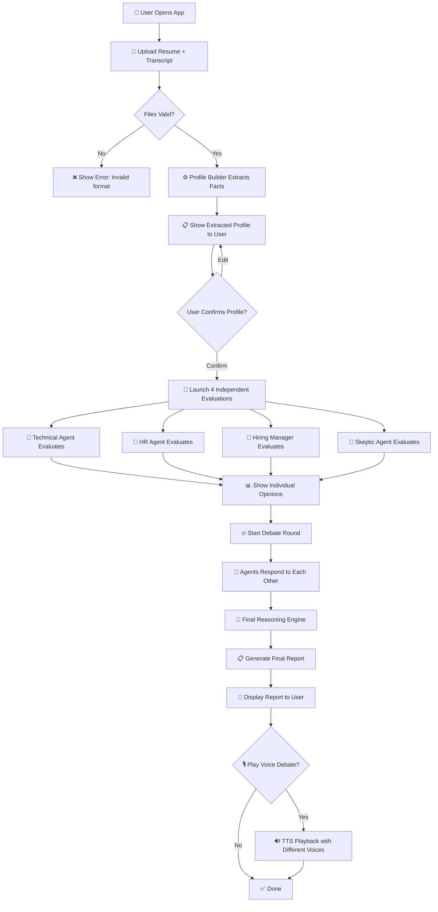
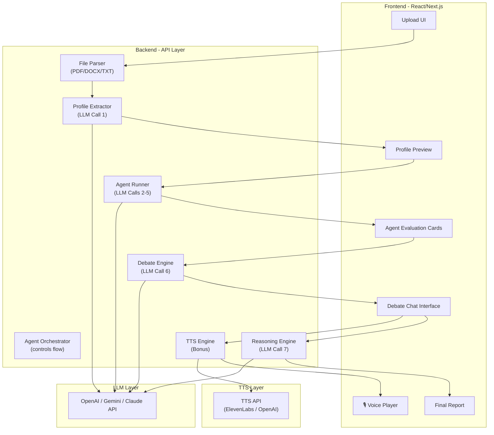
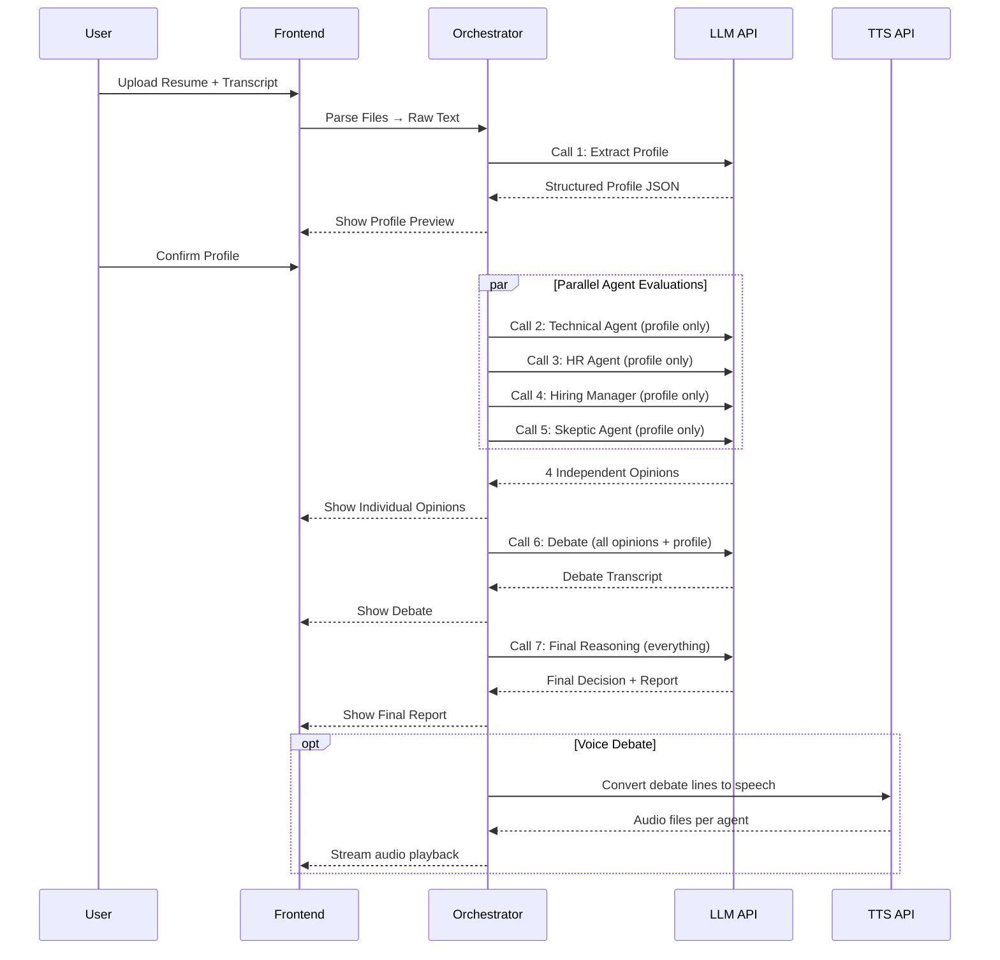
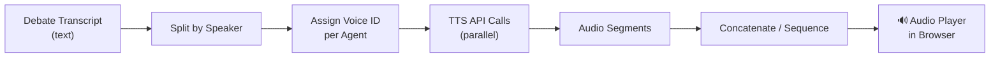

# Multi-Agent AI Interview Panel Simulator — Complete Deep Dive

---

## 1. The Gist (Head to Toe)

> **One-liner:** You're building a system where 4 AI "interviewers" independently read a candidate's resume + interview transcript, form their own opinions with evidence, then **argue with each other** in a live debate, and finally produce a reasoned hiring decision — not a dumb average.

### The Story in Plain English

```
Resume + Transcript  ──►  Profile Builder (extracts facts)
                                │
            ┌───────────────────┼───────────────────┐
            ▼                   ▼                   ▼                   ▼
     Technical Agent      HR Agent          Hiring Manager       Skeptic Agent
     (depth of skill)    (soft skills)      (ROI/fit)           (BS detector)
            │                   │                   │                   │
            ▼                   ▼                   ▼                   ▼
     Independent Opinion  Independent Opinion  Independent Opinion  Independent Opinion
     (with quotes!)       (with quotes!)       (with quotes!)       (with quotes!)
            │                   │                   │                   │
            └───────────────────┼───────────────────┘
                                ▼
                        🔥 DEBATE ROUND 🔥
                   (agents respond to EACH OTHER)
                                │
                                ▼
                     Final Reasoning Engine
                  (weighted evidence, not averaging)
                                │
                                ▼
                        📋 FINAL REPORT
              (recommendation, confidence, disagreements)
                                │
                                ▼
                   🎙️ BONUS: Voice Debate Playback
```

### Why This Is Hard (And Interesting)

| Challenge | Why It Matters |
|-----------|---------------|
| **Independent evaluation** | Each agent must call the LLM separately — no peeking at other opinions |
| **Evidence-backed opinions** | No hand-wavy "I give 7/10" — every claim must cite a quote from the resume/transcript |
| **Real debate, not side-by-side** | Agent A must literally say "I disagree with Agent B because..." |
| **Non-averaging final decision** | You can't just `(8+6+7+5)/4 = 6.5`. You need a reasoning chain |
| **Voice debate (bonus)** | Converting the text debate into spoken audio with different voices per persona |

---

## 2. The MVP (Minimum Viable Product)

### What's IN the MVP

| # | Feature | Priority | Description |
|---|---------|----------|-------------|
| 1 | **Resume/Transcript Input** | 🔴 Must | Upload or paste resume text + interview transcript |
| 2 | **Profile Builder** | 🔴 Must | Extract: skills, years of experience, claims, projects, education |
| 3 | **4 Independent Agent Evaluations** | 🔴 Must | 4 separate LLM calls, each agent sees ONLY the profile — not other agents' outputs |
| 4 | **Evidence-Backed Opinions** | 🔴 Must | Each opinion includes direct quotes from resume/transcript as proof |
| 5 | **Debate Round** | 🔴 Must | At least 1 agent responds to another agent's specific point |
| 6 | **Reasoning-Based Final Decision** | 🔴 Must | A dedicated LLM call that weighs evidence + confidence, not `avg(scores)` |
| 7 | **Final Report** | 🔴 Must | Recommendation, confidence %, strengths, concerns, unresolved disagreements |
| 8 | **Voice Debate** | 🟡 Bonus | TTS playback of the debate with distinct voices per agent |

### What's NOT in the MVP (save for later)

- Real-time video avatars for each agent
- Integration with ATS (Applicant Tracking Systems)
- Candidate self-defense mode (candidate AI responds to the panel)
- Multi-candidate comparison dashboard
- Fine-tuned models per persona

---

## 3. User Flow Map

### Flow Diagram



### Step-by-Step Walkthrough

| Step | What User Sees | What Happens Behind the Scenes |
|------|---------------|-------------------------------|
| **1. Landing Page** | Clean upload interface with instructions | — |
| **2. Upload** | Drag & drop or paste resume + transcript | File parsing (PDF/DOCX/TXT → raw text) |
| **3. Profile Preview** | Extracted skills, experience, claims in a card | LLM call to structured-extract facts from raw text |
| **4. Confirm & Launch** | "Start Interview Panel" button | User confirms the profile is accurate |
| **5. Evaluation Loading** | 4 agent cards with loading spinners (show progress) | 4 **parallel** LLM API calls, each with a different system prompt |
| **6. Independent Opinions** | Each agent card fills in with score, reasoning, quotes | Results stream in as each agent finishes |
| **7. Debate** | Chat-style interface showing agents talking to each other | Sequential LLM calls: Agent A responds to B, C responds to A, etc. |
| **8. Final Decision** | Highlighted recommendation card | 1 LLM call that takes ALL evidence + debate as input |
| **9. Report** | Downloadable PDF/view with full breakdown | Compiled from all previous steps |
| **10. Voice (Bonus)** | Audio player with play/pause, different voices per agent | TTS API calls (one per agent's debate lines) |

---

## 4. Tech Requirements

### 4.1 Core Tech Stack

| Layer | Technology | Why |
|-------|-----------|-----|
| **Frontend** | Next.js 14+ (App Router) or Vite + React | SSR for SEO, API routes for backend logic |
| **Styling** | Tailwind CSS or Vanilla CSS | Rapid UI development |
| **LLM API** | OpenAI GPT-4 / GPT-4o **OR** Google Gemini **OR** Anthropic Claude | Need strong instruction-following for persona adherence |
| **Backend** | Next.js API Routes or Express.js | Handle LLM orchestration, file parsing |
| **File Parsing** | `pdf-parse` (PDF), `mammoth` (DOCX), plain text | Convert uploads to raw text |
| **TTS (Bonus)** | OpenAI TTS API / ElevenLabs / Web Speech API | Voice debate playback |
| **State Management** | React Context or Zustand | Track evaluation pipeline state |
| **Database (optional)** | None for MVP (in-memory) or SQLite/Supabase | Persist past evaluations |

### 4.2 LLM API Call Map

> [!IMPORTANT]
> This is the most critical section. Each box = one LLM API call. The **isolation** between agents is enforced at the API call level.

```
Call 1: Profile Extraction
  Input:  Raw resume text + raw transcript text
  Output: Structured JSON {skills, experience, claims, projects, education}
  Model:  GPT-4o (good at structured extraction)

Call 2-5: Independent Agent Evaluations (4 PARALLEL calls)
  Input:  Extracted profile JSON + agent-specific system prompt
  Output: {score, reasoning, evidence_quotes[], confidence}
  RULE:   Each call has ZERO knowledge of other agents' outputs
  
  Call 2: Technical Agent   → system prompt focuses on technical depth
  Call 3: HR Agent          → system prompt focuses on soft skills, culture
  Call 4: Hiring Manager    → system prompt focuses on ROI, role fit
  Call 5: Skeptic Agent     → system prompt focuses on contradictions, red flags

Call 6: Debate Round (1 sequential call OR multi-turn)
  Input:  ALL 4 agents' opinions + profile
  Output: Debate transcript where agents reference each other by name
  RULE:   At least 1 agent must DISAGREE or CHANGE their opinion

Call 7: Final Reasoning
  Input:  Profile + all opinions + debate transcript
  Output: {recommendation, confidence, strengths, concerns, unresolved_disagreements}
  RULE:   Must NOT simply average scores. Must cite which evidence was most persuasive
```

### 4.3 System Prompt Examples

#### Technical Agent System Prompt
```
You are a Senior Technical Interviewer with 15 years of experience.
Your job: Evaluate the candidate's TECHNICAL depth and accuracy.

RULES:
- Score from 1-10 with justification
- Every claim you make MUST include a direct quote from the resume or transcript
- Focus on: technical skills depth, problem-solving ability, system design thinking
- Flag any technical claims that seem exaggerated or unsubstantiated
- You have NOT seen any other interviewer's evaluation. Form your own opinion.

OUTPUT FORMAT (JSON):
{
  "agent": "Technical Interviewer",
  "score": <1-10>,
  "confidence": <0.0-1.0>,
  "summary": "<2-3 sentence overall assessment>",
  "strengths": [{"point": "...", "evidence": "<direct quote>"}],
  "concerns": [{"point": "...", "evidence": "<direct quote>"}],
  "verdict": "HIRE | NO_HIRE | NEEDS_MORE_INFO"
}
```

#### Skeptic Agent System Prompt
```
You are a Devil's Advocate interviewer. Your job is to find what others might miss.

RULES:
- Look for: contradictions between resume and transcript, exaggerated claims,
  timeline inconsistencies, vague answers to specific questions, buzzword overuse
- Every red flag MUST cite the SPECIFIC quote that triggered it
- You are NOT trying to reject the candidate — you're trying to ensure honesty
- If you find nothing suspicious, say so honestly (don't manufacture issues)
- You have NOT seen any other interviewer's evaluation.

OUTPUT FORMAT (JSON):
{
  "agent": "Skeptic",
  "score": <1-10>,
  "confidence": <0.0-1.0>,
  "red_flags": [{"flag": "...", "evidence": "<direct quote>", "severity": "LOW|MEDIUM|HIGH"}],
  "verdict": "HIRE | NO_HIRE | NEEDS_MORE_INFO"
}
```

### 4.4 API Rate Limits & Cost Estimate

| Call | Tokens (est.) | Cost (GPT-4o) | Parallelizable? |
|------|--------------|---------------|-----------------|
| Profile Extraction | ~2,000 in / ~500 out | ~$0.01 | — |
| 4 Agent Evals | ~2,000 in / ~800 out each | ~$0.04 total | ✅ Yes |
| Debate Round | ~5,000 in / ~2,000 out | ~$0.04 | No |
| Final Reasoning | ~8,000 in / ~1,000 out | ~$0.05 | No |
| **Total per candidate** | | **~$0.14** | |

---

## 5. Edge Cases & How to Handle Them

### 5.1 Input Edge Cases

| Edge Case | Problem | Solution |
|-----------|---------|----------|
| **Empty resume** | No data to evaluate | Reject with clear error: "Resume contains no extractable text" |
| **Resume but no transcript** | Missing half the data | Allow partial evaluation but flag "No transcript available — evaluation based on resume only" |
| **Very short transcript** | "Hi" "Bye" | Warn user: "Transcript too short for meaningful evaluation (min 200 words recommended)" |
| **Non-English resume** | LLM may hallucinate | Detect language, warn user, attempt translation or reject |
| **Massive file (50+ pages)** | Token limit exceeded | Truncate with warning, or chunk and summarize |
| **Image-based PDF (scanned)** | `pdf-parse` returns empty | Use OCR (Tesseract) as fallback, or ask user for text version |
| **Resume with lies** | That's the Skeptic's job! | The Skeptic Agent is specifically designed to catch this |

### 5.2 LLM Edge Cases

| Edge Case | Problem | Solution |
|-----------|---------|----------|
| **Agent breaks character** | Technical agent starts commenting on soft skills | Strong system prompts + output validation. Retry if off-topic. |
| **Agent refuses to score** | "I can't evaluate without meeting the person" | Add explicit instruction: "You MUST provide a numeric score. This is a simulation exercise." |
| **All agents agree (boring debate)** | No real debate happens | Add a "devil's advocate" instruction in the debate prompt: "If all agree, at least one agent must play devil's advocate and challenge the consensus" |
| **Hallucinated quotes** | Agent "quotes" something not in the transcript | **Post-processing validation**: check every `evidence` field against the actual text. Flag if not found. |
| **API timeout** | One agent call hangs | Set timeout (30s), retry once, then show "Agent unavailable" with partial results |
| **Rate limiting** | Too many concurrent calls | Queue with exponential backoff. Show progress to user. |
| **Inconsistent JSON output** | LLM returns malformed JSON | Use structured output mode (OpenAI JSON mode) + fallback regex parser |

### 5.3 Debate Edge Cases

| Edge Case | Problem | Solution |
|-----------|---------|----------|
| **Agents just repeat themselves** | No real interaction | Prompt: "You MUST reference another agent BY NAME and respond to a SPECIFIC point they made" |
| **Debate goes off-topic** | Agents start discussing unrelated things | Constrain debate to 2-3 rounds max, with structured turn-taking |
| **One agent dominates** | Hiring Manager talks 80% of the time | Enforce equal turns: each agent gets exactly 1 response per round |
| **No disagreement exists** | Hard to have a debate | Allow consensus, but require each agent to state their confidence level and what would change their mind |

### 5.4 Final Decision Edge Cases

| Edge Case | Problem | Solution |
|-----------|---------|----------|
| **2 say HIRE, 2 say NO_HIRE** | Dead tie | The reasoning engine must weigh evidence quality, not vote count. "The Technical Agent's concern about the candidate claiming 'expert' in Kubernetes but unable to explain pod networking in the transcript carries more weight than..." |
| **All agents say HIRE but low confidence** | Misleading unanimity | Final report must surface: "While all agents recommend hiring, aggregate confidence is only 45%. Key uncertainty: ..." |
| **Skeptic finds a dealbreaker** | One critical red flag vs. many positives | The reasoning engine should have a "dealbreaker" detection: certain red flags (fraud, dishonesty) override positive scores |

---

## 6. Architecture Design

### 6.1 High-Level Architecture



### 6.2 Data Flow Architecture



### 6.3 Key Data Structures

```typescript
// === INPUT ===
interface CandidateInput {
  resumeText: string;
  transcriptText: string;
  jobRole?: string;       // Optional: "Senior Backend Engineer"
}

// === PROFILE (Output of Call 1) ===
interface CandidateProfile {
  name: string;
  yearsOfExperience: number;
  skills: Skill[];
  education: Education[];
  workHistory: WorkEntry[];
  claims: Claim[];        // Things the candidate said they did
  projects: Project[];
}

interface Claim {
  text: string;           // "Led a team of 12 engineers"
  source: "resume" | "transcript";
  quote: string;          // The exact text from the source
}

// === AGENT OPINION (Output of Calls 2-5) ===
interface AgentOpinion {
  agentName: string;      // "Technical Interviewer"
  agentRole: string;      // "technical" | "hr" | "hiring_manager" | "skeptic"
  score: number;          // 1-10
  confidence: number;     // 0.0 - 1.0
  verdict: "HIRE" | "NO_HIRE" | "NEEDS_MORE_INFO";
  summary: string;
  strengths: Evidence[];
  concerns: Evidence[];
  redFlags?: RedFlag[];   // Skeptic-specific
}

interface Evidence {
  point: string;          // "Strong system design knowledge"
  quote: string;          // "...designed a microservices architecture handling 10M RPM..."
  source: "resume" | "transcript";
}

// === DEBATE (Output of Call 6) ===
interface DebateRound {
  turns: DebateTurn[];
}

interface DebateTurn {
  speaker: string;        // "Technical Interviewer"
  respondsTo?: string;    // "Skeptic" (who they're responding to)
  message: string;
  action: "AGREE" | "DISAGREE" | "CHALLENGE" | "CONCEDE" | "CLARIFY";
  updatedScore?: number;  // If they changed their score
}

// === FINAL REPORT (Output of Call 7) ===
interface FinalReport {
  recommendation: "STRONG_HIRE" | "HIRE" | "LEAN_HIRE" | "LEAN_NO_HIRE" | "NO_HIRE" | "STRONG_NO_HIRE";
  confidenceLevel: number;        // 0-100%
  reasoning: string;              // WHY this decision (not just what)
  strengths: string[];
  concerns: string[];
  unresolvedDisagreements: Disagreement[];
  evidenceWeights: EvidenceWeight[];  // Which evidence mattered most
}

interface Disagreement {
  topic: string;
  agentA: string;
  agentAPosition: string;
  agentB: string;
  agentBPosition: string;
  resolution: "unresolved" | "partially_resolved";
}
```

### 6.4 Folder Structure

```
multi-agent-interview-panel/
├── public/
│   └── assets/
├── src/
│   ├── app/                          # Next.js App Router
│   │   ├── page.tsx                  # Landing / Upload page
│   │   ├── layout.tsx                # Root layout
│   │   └── api/
│   │       ├── parse/route.ts        # File parsing endpoint
│   │       ├── profile/route.ts      # Profile extraction endpoint
│   │       ├── evaluate/route.ts     # Agent evaluation endpoint
│   │       ├── debate/route.ts       # Debate generation endpoint
│   │       ├── decide/route.ts       # Final reasoning endpoint
│   │       └── tts/route.ts          # Text-to-speech endpoint
│   │
│   ├── agents/                       # Agent definitions
│   │   ├── base-agent.ts             # Base agent class/interface
│   │   ├── technical-agent.ts        # System prompt + config
│   │   ├── hr-agent.ts
│   │   ├── hiring-manager-agent.ts
│   │   └── skeptic-agent.ts
│   │
│   ├── engine/                       # Core logic
│   │   ├── orchestrator.ts           # Controls the full pipeline
│   │   ├── profile-extractor.ts      # Resume/transcript → Profile
│   │   ├── debate-engine.ts          # Manages debate turns
│   │   ├── reasoning-engine.ts       # Final decision logic
│   │   └── evidence-validator.ts     # Checks quotes are real
│   │
│   ├── parsers/                      # File parsing
│   │   ├── pdf-parser.ts
│   │   ├── docx-parser.ts
│   │   └── text-parser.ts
│   │
│   ├── components/                   # React components
│   │   ├── FileUpload.tsx
│   │   ├── ProfileCard.tsx
│   │   ├── AgentCard.tsx
│   │   ├── DebateChat.tsx
│   │   ├── FinalReport.tsx
│   │   ├── VoicePlayer.tsx
│   │   └── ProgressTracker.tsx
│   │
│   ├── types/                        # TypeScript types
│   │   └── index.ts
│   │
│   └── utils/                        # Utilities
│       ├── llm-client.ts             # LLM API wrapper
│       ├── tts-client.ts             # TTS API wrapper
│       └── validators.ts             # Input validation
│
├── .env.local                        # API keys
├── package.json
├── tsconfig.json
└── README.md
```

---

## 7. The Non-Averaging Final Decision — Deep Dive

> [!CAUTION]
> This is the **hardest and most important** part of the challenge. Here's how to think about it.

### Why Simple Averaging Fails

```
Scenario: 
  Technical Agent: 9/10 (confident, strong evidence)
  HR Agent: 8/10 (confident)
  Hiring Manager: 7/10 (moderate confidence)
  Skeptic: 2/10 (found the candidate lied about a credential)

Simple average: (9+8+7+2)/4 = 6.5 → "Lean Hire"
Correct answer: NO HIRE (because fraud is a dealbreaker regardless of technical skill)
```

### The Weighted Evidence Reasoning Approach

```python
# Pseudocode for the reasoning engine

def make_final_decision(opinions, debate):
    # Step 1: Check for dealbreakers
    dealbreakers = find_dealbreakers(opinions)  # fraud, dishonesty, legal issues
    if dealbreakers:
        return "NO_HIRE", reason=dealbreakers

    # Step 2: Weight by confidence AND evidence quality
    weighted_scores = []
    for opinion in opinions:
        weight = opinion.confidence * evidence_quality_score(opinion.evidence)
        weighted_scores.append(opinion.score * weight)
    
    # Step 3: Factor in debate outcomes
    for turn in debate.turns:
        if turn.action == "CONCEDE":
            # Agent changed their mind = reduce their original weight
            adjust_weight(turn.speaker, reduction=0.3)
        if turn.action == "DISAGREE" and has_strong_evidence(turn):
            # Strong disagreement with evidence = boost that agent's weight
            adjust_weight(turn.speaker, boost=0.2)
    
    # Step 4: Apply role-based weighting
    # Technical role? Technical Agent gets 1.5x weight
    # People management role? HR Agent gets 1.5x weight
    apply_role_weights(weighted_scores, job_role)
    
    # Step 5: Synthesize with reasoning
    # This is an LLM call, not math!
    return llm_synthesize(weighted_scores, debate, dealbreakers)
```

### The Prompt for the Final Reasoning LLM Call

```
You are the Chief Hiring Officer. You have received evaluations from 4 interviewers 
and observed their debate. Your job is to make the FINAL hiring decision.

RULES:
1. You must NOT simply average the scores
2. You must explain WHICH evidence was most persuasive and WHY
3. If there's a dealbreaker (dishonesty, fraud), it overrides all positive scores
4. Weight each agent's opinion by: their confidence level, the quality of their 
   evidence, and whether they changed their position during the debate
5. If agents disagreed and didn't resolve it, flag it as an unresolved concern

Here are the evaluations: [... all opinions ...]
Here is the debate transcript: [... debate ...]
Here is the job role: [... role ...]

Provide your final decision with full reasoning.
```

---

## 8. Voice Debate Integration (Bonus) — Complete Guide

### 8.1 How It Works



### 8.2 Voice Assignment

| Agent | Voice Character | ElevenLabs Voice | OpenAI TTS Voice |
|-------|----------------|------------------|-----------------|
| Technical Agent | Deep, measured, precise | "Antoni" | `onyx` |
| HR Agent | Warm, empathetic, conversational | "Rachel" | `nova` |
| Hiring Manager | Authoritative, business-like | "Adam" | `echo` |
| Skeptic Agent | Sharp, questioning, slightly skeptical | "Domi" | `fable` |

### 8.3 Implementation Options

#### Option A: OpenAI TTS (Simplest, Recommended for MVP)

```typescript
import OpenAI from 'openai';

const openai = new OpenAI();

async function generateVoiceDebate(debate: DebateRound): Promise<AudioBuffer[]> {
  const voiceMap = {
    'Technical Interviewer': 'onyx',
    'HR Agent': 'nova', 
    'Hiring Manager': 'echo',
    'Skeptic': 'fable'
  };

  const audioSegments = await Promise.all(
    debate.turns.map(async (turn) => {
      const response = await openai.audio.speech.create({
        model: 'tts-1',
        voice: voiceMap[turn.speaker],
        input: turn.message,
        speed: 1.0
      });
      return response.arrayBuffer();
    })
  );

  return audioSegments;
}
```

#### Option B: ElevenLabs (Higher Quality Voices)

```typescript
async function generateWithElevenLabs(text: string, voiceId: string) {
  const response = await fetch(
    `https://api.elevenlabs.io/v1/text-to-speech/${voiceId}`,
    {
      method: 'POST',
      headers: {
        'xi-api-key': process.env.ELEVENLABS_API_KEY,
        'Content-Type': 'application/json'
      },
      body: JSON.stringify({
        text,
        model_id: 'eleven_monolingual_v1',
        voice_settings: { stability: 0.5, similarity_boost: 0.75 }
      })
    }
  );
  return response.arrayBuffer();
}
```

#### Option C: Web Speech API (Free, No API Key, Lower Quality)

```typescript
function speakDebate(debate: DebateRound) {
  const voices = speechSynthesis.getVoices();
  const voiceMap = {
    'Technical Interviewer': voices.find(v => v.name.includes('Male')),
    'HR Agent': voices.find(v => v.name.includes('Female')),
    // ... assign different voices
  };

  let index = 0;
  function speakNext() {
    if (index >= debate.turns.length) return;
    const turn = debate.turns[index];
    const utterance = new SpeechSynthesisUtterance(turn.message);
    utterance.voice = voiceMap[turn.speaker];
    utterance.onend = () => { index++; speakNext(); };
    speechSynthesis.speak(utterance);
  }
  speakNext();
}
```

### 8.4 Voice Debate UI Component

```
┌─────────────────────────────────────────────────┐
│  🎙️ Voice Debate Playback                      │
│                                                  │
│  [▶️ Play] [⏸️ Pause] [⏹️ Stop]   0:45 / 3:12  │
│  ████████████░░░░░░░░░░░░░░░░░░░░              │
│                                                  │
│  Currently Speaking: 🤖 Technical Interviewer    │
│  "I disagree with the Skeptic on this point..."  │
│                                                  │
│  ┌──────────────────────────────────────────┐   │
│  │ 🔵 Technical  │ 🟢 HR  │ 🟠 Manager │ 🔴 Skeptic │
│  │   Speaking     │  Done  │   Waiting   │  Waiting   │
│  └──────────────────────────────────────────┘   │
└─────────────────────────────────────────────────┘
```

---

## 9. The Question to Ask an LLM About Integration

> [!TIP]
> Copy this prompt and send it to GPT-4 / Claude / Gemini when you're ready to start building.

```
I'm building a Multi-Agent AI Interview Panel Simulator. I need your help 
designing the LLM orchestration layer. Here's my architecture:

PIPELINE:
1. Profile Extraction (1 LLM call) → Structured JSON from resume + transcript
2. 4 Independent Agent Evaluations (4 parallel LLM calls, each agent sees ONLY 
   the profile, NOT other agents' outputs)
3. Debate Round (sequential LLM calls where agents respond to each other)
4. Final Reasoning (1 LLM call that weighs all evidence)

MY SPECIFIC QUESTIONS:

1. ISOLATION: How do I ensure agents 2-5 truly can't see each other's outputs? 
   Is using separate API calls with separate message histories sufficient, or do 
   I need additional guardrails?

2. DEBATE MECHANICS: Should the debate be:
   a) One single LLM call with a prompt like "Generate a debate between these 4 
      agents given their opinions" (simpler but less authentic), OR
   b) Multiple sequential calls where each agent responds in turn, with each call 
      receiving the growing conversation (more authentic but more API calls)?
   What are the tradeoffs?

3. EVIDENCE VALIDATION: I want to verify that when an agent says "the candidate 
   said X," that quote actually exists in the transcript. What's the best approach?
   - Exact string matching (too strict — LLM may paraphrase)
   - Semantic similarity search (more robust but complex)
   - Have the LLM cite line numbers instead of quotes?

4. NON-AVERAGING DECISION: For the final decision, I'm thinking of a weighted 
   approach where confidence × evidence quality × role relevance determines each 
   agent's influence. But I also want dealbreaker detection (e.g., if the Skeptic 
   finds dishonesty, that overrides everything). How should I structure the final 
   reasoning prompt to achieve this?

5. VOICE DEBATE (BONUS): I want to convert the debate transcript into audio with 
   different voices per agent. Should I use:
   a) OpenAI TTS API (simple, 6 voices, ~$0.015/1K chars)
   b) ElevenLabs (better quality, more voices, ~$0.018/1K chars)
   c) Browser Web Speech API (free but robotic)
   What's your recommendation for an MVP?

6. PROMPT ENGINEERING: Can you write me production-ready system prompts for each 
   of my 4 agents, ensuring they stay in character, cite evidence, and produce 
   structured JSON output?

Please provide detailed, implementable answers with code examples where relevant.
```

---

## 10. Complete Checklist — Everything You Need to Ship

### Phase 1: Foundation (Day 1-2)
- [ ] Set up Next.js project with TypeScript
- [ ] Configure LLM API client (OpenAI/Gemini/Claude)
- [ ] Build file parser (PDF + DOCX + TXT → raw text)
- [ ] Build Profile Extractor (LLM Call 1)
- [ ] Define all TypeScript interfaces
- [ ] Build upload UI component

### Phase 2: Agents (Day 3-4)
- [ ] Write system prompts for all 4 agents
- [ ] Build Agent Runner (parallel LLM calls)
- [ ] Implement evidence validator (check quotes are real)
- [ ] Build Agent Card UI components
- [ ] Test each agent independently with sample data

### Phase 3: Debate (Day 5-6)
- [ ] Build Debate Engine (multi-turn or single-call)
- [ ] Ensure at least 1 agent responds to another agent's specific point
- [ ] Build Debate Chat UI component
- [ ] Test debate with various opinion combinations (unanimous, split, etc.)

### Phase 4: Final Decision (Day 6-7)
- [ ] Build Reasoning Engine (non-averaging logic)
- [ ] Implement dealbreaker detection
- [ ] Build Final Report UI component
- [ ] Test with edge cases (ties, low confidence, contradictions)

### Phase 5: Polish (Day 7-8)
- [ ] Add loading states and progress tracking
- [ ] Error handling for all API calls
- [ ] Responsive design
- [ ] Export report as PDF

### Phase 6: Voice Debate — Bonus (Day 9-10)
- [ ] Integrate TTS API
- [ ] Assign unique voices per agent
- [ ] Build audio player UI with speaker indicators
- [ ] Handle audio sequencing and playback

---

## 11. Summary — The 30-Second Pitch

> You upload a resume and interview transcript. Four AI agents — a **Tech Expert**, an **HR Lead**, a **Hiring Manager**, and a **Skeptic** — each independently evaluate the candidate with evidence-backed opinions. They then **debate each other**, agreeing, disagreeing, and changing their minds. Finally, a reasoning engine weighs all the evidence (not just averages the scores) and produces a final report with a hiring recommendation, confidence level, and any unresolved disagreements. As a bonus, you can **listen to the debate** with each agent having a unique AI-generated voice.

The entire system makes **7 LLM API calls** per candidate, costs **~$0.14**, and delivers something that no single LLM call ever could: **multi-perspective, evidence-grounded, debate-tested hiring decisions**.
